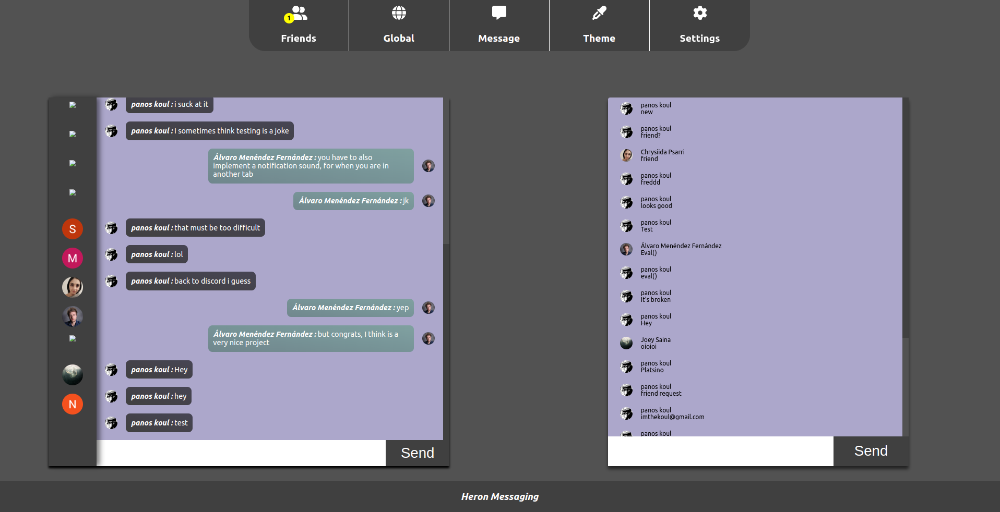

# Heron-message-app

  
  
  
  

## About

An instant messaging application built with redux toolkit and react firebase hooks.

Check out the client <a href='https://heron-messaging.web.app/'>Here</a>
